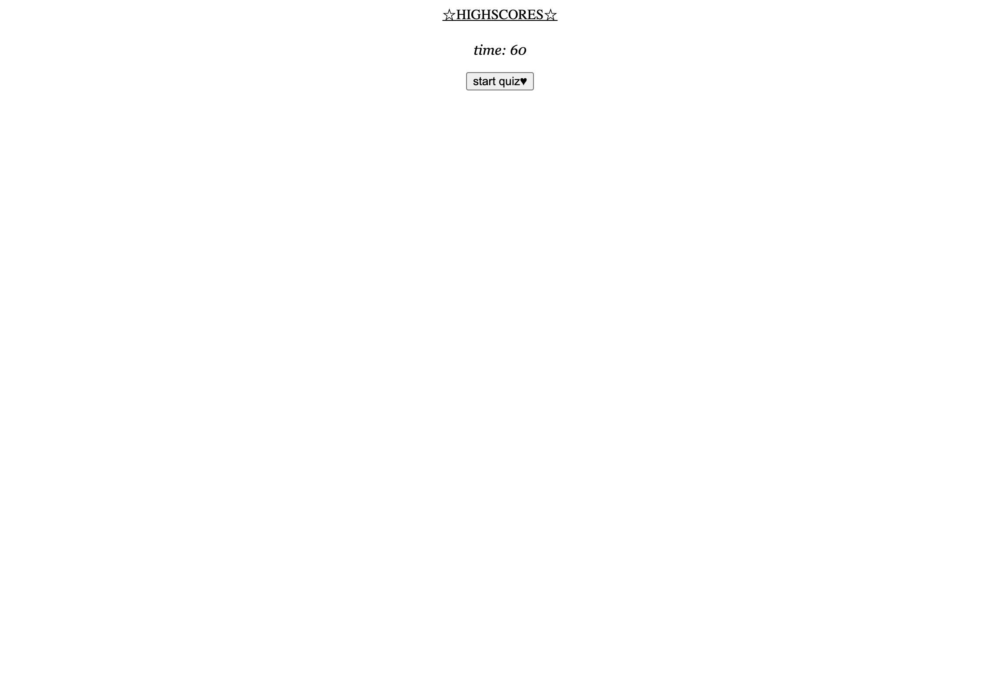

# Code Quiz

## Description
A timed, multiple-choice coding quiz. User is able to enter initials at the end of the quiz, as well as view highscores.

## Usage
Pressing 'Start Quiz' will begin the timer and run the questions. The user has three answer choices, and a prompt will inform whether or not they have answered correctly. If correct, time will be added to the timer. If incorrect, time will be deducted. The user can view highscores at the end of the quiz, or at any time. At the end of the quiz, the final score is displayed, and the user should enter their initials to be logged to the Highscores page.

## Homepage

This is the homepage of the quiz. Open the quiz to find the many other pages!

## Deployment
Application is deployed with GitHub Pages at: https://middlenamestar.github.io/code-quiz/